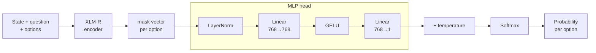
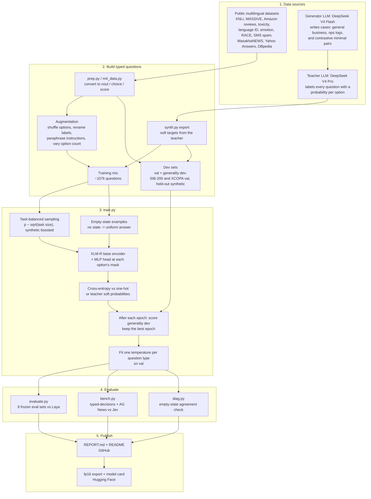

# Naluri: instinctive, multilingual decisions in one pass

**Naluri** (Indonesian for *instinct*; **N**eural **A**nswering via **L**abel **U**nderstanding and **R**apid **I**nference) is a multilingual *System One* decision model built from XLM-RoBERTa base. You give it a text and a typed question (yes/no, pick one, or rate on a scale) with the answer options written out, and it returns calibrated probabilities over those options in a single forward pass, in about 6–15 ms on a laptop GPU.

*Status: work in progress. M0–M7 are complete. **M6-pairs (minimal pairs only) is the published model:** typed-decisions zero-shot 46.9%, and it genuinely reads the state more (empty-state agreement 93% → 52%). M7 scores higher (48.6%) but partly through a shifted default answer. Earlier releases are kept as Hugging Face revisions `m4` and `m5`. M4 is the mean of 2 seeds; the others are single runs.*

## Summary

- **The best model is Naluri M4:** M2 continued with task-balanced sampling, synthetic decisions and public topic data. It trains in about 35 minutes on an 8 GB laptop GPU (RTX 5050).
- **M4 beats zero-shot Laya on SIB-200 topics** (74.4% vs 70.8%, trained on other topic datasets), and its AG News calibration error is 0.034 vs Laya's 0.052 and Jev's 0.080.
- **On task types it never trained on, it is close to or ahead of zero-shot Laya-multilingual:**
  - XCOPA cause/effect: **58.6%** vs 54.7%. Laya is near chance; M2 wins in 9 of 11 languages.
  - Belebele reading: **34.8%** vs 33.1%. This is within noise, and Belebele is only partly unseen once RACE is in training.
  - SIB-200 topic: 67.5% vs **70.8%**. Laya still leads, but the gap shrank from 15.4 points (M1) to 3.3.
- **On trained tasks it beats Laya clearly, including in languages it never saw for that task:** intent in unseen languages is **75.7%** vs 37.6%.
- **Honest confidence:** calibration error (ECE) is 0.03–0.07 on every eval set, versus 0.12–0.56 for Laya.
- **Speed:** a median of about 5 ms per question on the laptop GPU, versus about 9–19 ms for Laya in the same setup.
- **Head-to-head with Jev, measured live:** after a 17-minute fine-tune on the typed-decisions training split, Naluri scores **72.5% vs Jev's 73.8%** on its 2,000 test decisions. That is a statistical tie (p = 0.29), with better calibration and about 6× lower latency. Zero-shot, Jev is far ahead there (29.0% for Naluri), and on AG News topics Jev leads 88.0% vs 74.5%.
- **What fixed generality:** M1's specialization problem (unseen-topic accuracy fell to 55.4%) was solved by **more kinds of tasks with fewer examples each**, plus **keeping the epoch that scores best on unseen-task validation data** rather than the last one.

## How it works

Every decision is a **typed question**. The question, the answer options and the text are packed into one input:

```
<s> {type} question: {instructions} </s> <mask> {option 1} <mask> {option 2} ... </s> {text} </s>
```

- **Encoder:** XLM-RoBERTa base (≈280M parameters, 100 languages), fully fine-tuned. It is bidirectional, so every option attends to the question, the other options and the text.
- **Decision head:** a small MLP (LayerNorm → Linear → GELU → Linear) reads the encoder's vector at each option's `<mask>` and outputs one score per option. A softmax over a question's options gives the answer distribution. There are no extra transformer layers, unlike Laya's 2-layer head.
- **Question types:**
  - `noul` (yes/no): the options are `false` and `true`, optionally with descriptions
  - `choice` (pick one): 2 or more named options, optionally with descriptions
  - `score` (ordered levels): the expected level is the score
- **Training:** cross-entropy on the correct option. After training, one temperature per question type is fitted on a held-out validation split to calibrate the probabilities.
- **Input format:** the same layout as Laya, so requests in the `/v1/systemone` style (TypeSafe Jev and `laya-serve`) map onto it directly.

The key difference from a plain classifier: the option texts are **input**, not fixed output slots. The model reads what each option *means*, so new questions and label sets need no new head.

### Model: from input to probabilities



### Training pipeline



## Training data

All data is public, converted into typed questions with augmentation:
- options shuffled every time
- labels renamed (e.g. `entailment` / `yes` / `follows`)
- 3–5 paraphrases per instruction
- a varying number of options (2–12)
- noul, choice and score questions mixed

| Task | Source | Languages | M0 | M1 | M2 |
|---|---|---|---|---|---|
| Logic / entailment | XNLI | 10 | 15k | 50k | 20k |
| Intent | MASSIVE (`mteb/amazon_massive_intent`) | 20 | 16k | 16k | 16k |
| Paraphrase | PAWS-X | 7 | – | 21k | dropped (not learned) |
| Review stars (`score`) + polarity | Amazon Reviews Multi | 6 | – | 18k | 9k |
| Toxicity | TextDetox multilingual | 14 | – | – | ~10k |
| Language ID | papluca/language-identification | 20 | – | – | 6k |
| Emotion | dair-ai/emotion | en | – | – | 5k |
| Reading comprehension | RACE | en | – | – | 8k |
| SMS spam | UCI SMS Spam | en | – | – | 3k |
| **Total** | | | **30k** | **~103k** | **~77k** |
| Epochs | | | 1 | 2 | 3 (best epoch kept) |

M2 also scores a **generality dev set** after each epoch: the *validation* splits of SIB-200 and XCOPA, two task types that are never trained on. It keeps the epoch with the best score. The test sets are never used for any decision.

## Evaluation

Nine eval sets, **frozen** after they were first built, so every run is scored on exactly the same questions. The baseline is **Laya-multilingual** (`convaiinnovations/laya`, mmBERT-base, 322M) used zero-shot. The comparison with Laya is only fair on unseen tasks: on tasks Naluri trained on, Naluri has an advantage by construction.

- **Seen tasks:** MASSIVE and XNLI test sets, in trained *and* unseen languages; Amazon test (score)
- **Seen skill, new data:** multilingual sentiment (tweets and news in Indonesian, Malay, Hindi, Arabic, Portuguese, Italian and English), where training only had product reviews
- **Unseen tasks:** SIB-200 topic classification (12 languages, incl. Yoruba and Amharic), XCOPA cause/effect (11 languages), Belebele reading comprehension (12 languages)

\* From M2 on, RACE teaches reading comprehension, so Belebele becomes "same skill, new dataset and languages" rather than a fully unseen task.

**Metrics:**
- accuracy (overall and per language)
- mean absolute error of the expected level (score questions)
- expected calibration error (ECE)
- **order consistency:** whether the answer stays the same after shuffling the options (a known weakness of LLMs used as multiple-choice classifiers)
- median single-question latency

## Results

<!-- generated by `python make_table.py`; bold = best; M4 = mean of 2 seeds; others = 1 seed -->
| Eval set | Random | Naluri M0 | Naluri M1 | Naluri M2 | Naluri M3 | Naluri M4 | Naluri M5 | Naluri M6 | Naluri M6-pairs | Naluri M7 | Laya (zero-shot) | Fair vs Laya? |
|---|---|---|---|---|---|---|---|---|---|---|---|---|
| MASSIVE intent, trained languages | 12.5% | 82.5% | 90.5% | 91.3% | 91.7% | 90.9% | 91.9% | 91.3% | **92.1%** | **92.1%** | 62.5% | no: task trained |
| MASSIVE intent, unseen languages | 12.5% | 65.5% | 70.4% | 75.7% | 72.4% | 75.0% | 75.7% | 75.2% | **75.8%** | 75.2% | 37.6% | no: task trained |
| XNLI logic, trained languages | 33.3% | 33.7% | 62.8% | 64.5% | 63.3% | 64.9% | 64.6% | 63.1% | **65.3%** | 63.1% | 54.5% | no: task trained |
| XNLI logic, unseen languages | 33.3% | 36.2% | 57.7% | 56.0% | 58.9% | 57.4% | 56.5% | **59.4%** | 58.1% | 56.8% | 46.1% | no: task trained |
| Amazon stars (1-5, exact) | 20.0% | 19.7% (MAE 1.26) | **56.9%** (MAE 0.60) | 52.0% (MAE 0.62) | 52.1% (MAE 0.64) | 54.0% (MAE 0.60) | 56.6% (MAE 0.58) | 55.8% (MAE 0.58) | 55.7% (MAE 0.58) | 55.4% (MAE 0.58) | 29.0% (MAE 1.45) | no: task trained |
| Sentiment, new domain + languages | 33.3% | 34.5% | 57.2% | 57.4% | 62.3% | 63.4% | 62.7% | 63.3% | 61.1% | **63.6%** | 52.7% | partly: similar skill |
| XCOPA cause/effect (unseen task) | 50.0% | 49.7% | 54.8% | **58.6%** | 57.2% | 57.2% | 58.0% | 57.9% | 57.2% | 57.8% | 54.7% | yes |
| SIB-200 topic (unseen task**) | 14.3% | 61.1% | 55.4% | 67.5% | 62.4% | **74.4%** | 73.7% | 71.0% | 73.2% | 73.0% | 70.8% | yes** |
| Belebele reading (unseen task*) | 25.0% | 28.6% | 28.9% | 34.8% | 34.2% | 33.7% | 35.2% | **36.2%** | **36.2%** | 34.5% | 33.1% | yes* |

| Metric (range over eval sets) | Naluri M0 | Naluri M1 | Naluri M2 | Naluri M3 | Naluri M4 | Naluri M5 | Naluri M6 | Naluri M6-pairs | Naluri M7 | Laya (zero-shot) |
|---|---|---|---|---|---|---|---|---|---|---|
| Calibration error (ECE, lower is better) | 0.01–0.22 | 0.02–0.11 | 0.03–0.07 | 0.03–0.07 | 0.03–0.11 | 0.03–0.13 | 0.02–0.12 | 0.03–0.14 | 0.02–0.17 | 0.12–0.56 |
| Order consistency (higher is better) | 0.39–0.94 | 0.64–0.96 | 0.72–0.97 | 0.70–0.96 | 0.68–0.97 | 0.65–0.97 | 0.70–0.97 | 0.67–0.97 | 0.71–0.96 | 0.68–0.94 |
| Latency p50, ms (RTX 5050) | 5.60–9.70 | 6.40–14.60 | 4.60–5.20 | 4.50–5.10 | 4.65–5.55 | 4.60–5.20 | 4.60–5.20 | 4.80–5.30 | 4.80–5.30 | 9.30–18.50 |

\*\* From M4 on, Naluri trains on other topic datasets (MasakhaNEWS, Yahoo Answers, DBpedia), so SIB-200 becomes "same skill, new dataset" rather than a fully unseen task. Its test set is still never trained on.

Low order consistency mostly goes with low accuracy: when a model is guessing, shuffling changes its guess.

### Per-language highlights
- **SIB-200 topic, M2 vs Laya:** M2 wins in **Amharic (+16.2 points)** and Chinese (+1.4), and trails by 1–9 points elsewhere. **Yoruba** is still the weakest language (29.9% vs 42.2%), since XLM-R saw little Yoruba in pre-training.
- **XCOPA cause/effect, M2 vs Laya:** M2 wins in 9 of 11 languages (Thai +12.0, Estonian +6.8, Turkish +5.6, Indonesian +5.0). It trails slightly in Haitian Creole and Quechua, the two lowest-resource languages.
- **Sentiment in Indonesian: 86.7%** (M1; Laya 72.0%), with no Indonesian sentiment data in training.

## Head-to-head with Jev (measured live)

`bench.py --jev` calls TypeSafe's API (`jev-latest`, which reports as `jev-1.13.0`) with exactly the same questions as the local models, and caches every response (`results/jev_cache.jsonl`). Scoring follows Laya's fine-tuning notebook: choice = top option, yes/no = p(true) ≥ 0.5, score = top level, all against the gold label.

### typed-decisions test (400 cases, 2,000 decisions: agent traces, customer service, invoices, security incidents)

| Model | Accuracy | Calibration error (lower is better) | Score MAE (lower is better) | Median time per case |
|---|---|---|---|---|
| **Jev 1.13.0 (live)** | **73.8%** | 0.042 | 0.389 | 307 ms (API, over the internet) |
| **Naluri M2, fine-tuned on typed-decisions train** | 72.5% | **0.020** | **0.356** | **54 ms** (RTX 5050 laptop) |
| Laya fine-tuned (published, not measured here) | 76.6% | – | – | – |
| Naluri M2, zero-shot | 29.0% | 0.178 | 0.693 | 54 ms |
| Laya-multilingual, zero-shot (measured here) | 35.2% | 0.315 | 0.761 | 94 ms |
| Majority class / teacher self-agreement (published) | 46.1% / 73.5% | | | |

- **Fine-tuned Naluri is statistically tied with Jev.** On the 556 decisions where they disagree, Naluri is right 265 times and Jev 291 (exact McNemar test, p = 0.29).
- **Naluri has better-calibrated confidence and lower score error, and runs about 6× faster** on a laptop GPU at no per-call cost.
- **Per workflow:** Naluri leads on agent traces (70.6% vs 62.8%), Jev on invoices (78.6% vs 68.8%) and customer service (78.8% vs 76.0%), and security incidents are close (74.6% vs 75.0%).
- **Fine-tuning:** 1,080 training cases (5,400 questions), 4 epochs starting from M2, with the teacher's soft probabilities as targets. It took about 17 minutes. Validation accuracy went from 31.7% to 74.2%.
- **Our live Jev score (73.8%) is close to the published 72.7%,** and our Laya zero-shot score (35.2%) is close to its published 34.2%. That supports the scoring being right.
- **Zero-shot, Naluri fails on this benchmark.** The nested JSON states and business-policy questions are unlike anything it trained on, and it collapses onto one option per question.

### AG News (2,000-article sample, 4 topics)

| Model | Accuracy | Calibration error | Median time |
|---|---|---|---|
| Laya-multilingual, zero-shot (measured here) | **92.0%** | 0.052 | 19 ms |
| Jev 1.13.0 (live) | 88.0% | 0.080 | 307 ms |
| Naluri M2, zero-shot | 74.5% | 0.169 | 9 ms |
| Naluri M2, fine-tuned on typed-decisions | 72.1% | 0.071 | 9 ms |

Topic classification is still Naluri's weakest unseen skill (see SIB-200 as well). Fine-tuning on typed-decisions cost 2.4 points here: specializing trades away a little generality.

**Jev usage for the whole benchmark:** 2,400 calls, about 1.17M input and 0.15M output tokens.

## M3: teacher-labeled synthetic data (pilot)

**Goal:** close the zero-shot gap to Jev on structured business decisions without training on typed-decisions data.

- **Data:** DeepSeek V4 Flash wrote 1,794 decision cases (45 business domains, 17 languages, about 31% English). Each has a nested-JSON, email or chat state and 2–4 noul, choice or score questions. typed-decisions' own four workflows were excluded. DeepSeek V4 Pro labeled every question with a probability per option, with the options in a random order per case. That gave **5,000 soft-labeled decisions** (4,700 for training).
- **Teacher check:** on 100 typed-decisions *train* questions, Pro agreed with the gold labels 73% of the time and Flash 64%. The gold labels' own teacher self-agreement is 73.5%.
- **Training:** M2's public mix + 4,700 synthetic decisions, from XLM-R base, 3 epochs at max length 512, keeping the most general epoch (epoch 2).
- **API cost:** $3.95 in total, at the proxy's configured prices.

| Zero-shot | Naluri M2 | **Naluri M3** | Laya-multilingual | Jev 1.13.0 (live) |
|---|---|---|---|---|
| typed-decisions test (2,000 decisions) | 29.0% | **38.6%** | 35.2% | 73.8% |
| AG News (2,000 sample) | **74.5%** | 67.7% | 92.0% | 88.0% |

- **The target metric improved:** typed-decisions zero-shot went from 29.0% to 38.6% (+9.6 points), now above Laya zero-shot. Customer service reached 52.0%. But it is **well below the 55% pilot goal** and Jev's 73.8%.
- **Some general skills got worse:** SIB-200 went from 67.5% to 62.4% and AG News from 74.5% to 67.7%. Sentiment in a new domain improved (57.4% to 62.3%), and so did XNLI in unseen languages (56.0% to 58.9%).
- **Likely reasons:**
  1. The synthetic data is only about 6% of the training mix (4,700 of 80k), so it's underweighted.
  2. Naluri reproduces the teacher's top answer on only 55% of held-out synthetic questions. These are hard, deliberately ambiguous decisions, so 4,700 examples are too few.
  3. Epoch selection optimizes the SIB-200/XCOPA dev set, not structured decisions.
  4. Single seed: part of the SIB-200 and AG News drop may be run-to-run variance.

## M4: balanced multi-task training (2 seeds)

**Changes from M3:**
- continue from M2 at a lower learning rate (encoder 1e-5, head 1e-4) for 2 epochs
- **task-balanced sampling** (p(task) ∝ √size) with a 3× boost for synthetic decisions (about 5% → about 18% of each epoch)
- **+11,800 public topic questions:** MasakhaNEWS (16 African languages), Yahoo Answers, DBpedia
- epoch selection on the **mean of per-task dev accuracies** (SIB-200, XCOPA, synthetic)
- **a soft-target bug fix:** in M3, teacher probabilities were only used when every item in a batch had them. Since synthetic data was 5% of the mix, most synthetic examples were trained on the teacher's top answer instead. M4 uses soft targets per item.

| | M2 | M3 | **M4 seed 0** | **M4 seed 1** | Laya (zero-shot) | Jev (live) |
|---|---|---|---|---|---|---|
| SIB-200 topic | 67.5% | 62.4% | **74.5%** | **74.4%** | 70.8% | – |
| AG News topic | 74.5% | 67.7% | 76.6% | 75.3% | **92.0%** | 88.0% |
| typed-decisions zero-shot | 29.0% | 38.6% | 39.0% | 39.6% | 35.2% | **73.8%** |
| Sentiment, new domain | 57.4% | 62.3% | **64.0%** | 62.8% | 52.7% | – |
| AG News calibration error | 0.169 | 0.126 | **0.024** | 0.043 | 0.052 | 0.080 |

- **The two seeds agree within about 1 point everywhere,** so these changes are real, not noise.
- **Topic skill is fixed:** SIB-200 +12 points over M3 and +7 over M2, now above Laya. AG News is at its best so far (76.0% on average), but still well below Laya and Jev.
- **typed-decisions zero-shot barely moved** (38.6% → 39.3%) despite 3× more synthetic weight and the soft-target fix. Naluri now fits the synthetic decisions better (about 58% on held-out ones, vs 55% in M3), but that **doesn't transfer** to typed-decisions. Choice questions stay around 29–32%, and agent traces around 25%.
- **Interpretation:** the missing piece for typed-decisions is not *how* the synthetic data is used but *what* it contains. It needs agent-trace, workflow and policy-style decisions at much larger scale, or at least closer in structure to those states.
- **Costs:** XCOPA (57.2% vs M2's 58.6%) and Belebele (33.7% vs 34.8%) dipped by about 1 point.

## M5: operational decision data

**Goal:** close more of the typed-decisions zero-shot gap. M4 showed the problem was the *content* of the synthetic data, not how it was used.

- **Data:** DeepSeek V4 Flash wrote 4,000 cases in an "ops" profile: structured run and event logs from 30 operational domains (CI/CD, ETL jobs, RPA bots, IoT telemetry, approval workflows, fraud-rule hits, SLA breaches…) in 17 languages. The questions follow typed-decisions-style *archetypes*: next action, outcome grade, risk level, needs review, policy violation, owner queue. typed-decisions' own four workflows stayed excluded, so this is "question-archetype matched", not domain-matched.
- **Labels:** 3,068 valid cases → 10,451 decisions labeled by DeepSeek V4 Pro (about 23% of the generated cases were malformed and dropped).
- **Training:** continue from M4 (seed 0) with the same balanced recipe (synthetic weight 2×), 2 epochs, the epoch picked on SIB-200, XCOPA and both synthetic dev sets.
- **API cost:** $8.33 (total across all rounds: $12.28).

| Zero-shot | M4 (2-seed mean) | **M5** | Laya-multilingual | Jev 1.13.0 (live) |
|---|---|---|---|---|
| typed-decisions (2,000 decisions) | 39.3% | **43.0%** | 35.2% | 73.8% |
| – agent traces | ~25% | **36.4%** | – | 62.8% |
| – score questions, MAE (lower is better) | ~0.65 | **0.506** | 0.761 | 0.389 |
| AG News | 76.0% | **77.3%** | 92.0% | 88.0% |

- **typed-decisions +3.7 points,** with the largest gains exactly where the ops data points: agent traces (+11 points) and score questions (error down by a fifth). **Choice questions are still stuck at about 30%**: the model has learned *when* an operation is risky or failing better than *which action or outcome label* to pick.
- **Nothing got worse:** M5 is best or within about 1 point of the best on every other eval set (Belebele 35.2%, Amazon 56.6%, AG News 77.3%, SIB-200 73.7%).
- **Held-out ops decisions:** agreement with the teacher went from 47.7% to 67.3%.
- **The gap to Jev is still large** (43.0% vs 73.8%). The choice-question failure mode, not data volume alone, looks like the next thing to investigate.

### Why choice questions fail: a shortcut (diagnosis, `diag.py`)

For each typed-decisions choice question, M5's answer mix vs the gold mix (100 cases per question):

| Question | Gold answers | M5 picks | Jev accuracy |
|---|---|---|---|
| security incidents / disposition | investigate 74, contain 15, monitor 8, close_benign 3 | **close_benign 98** | 79% |
| invoices / disposition | approve 45, manual_review 38, hold 12, reject 5 | **hold 100** | 65% |
| customer service / action | escalate 52, request_information 24, answer 17, refund 7 | **escalate 100** | 64% |
| agent traces / outcome | success 50, partial 26, harmful 19, failure 5 | **partial 93** | 78% |
| agent traces / action | human_review 36, continue 31, observe 31, stop 2 | **continue 88** | 60% |

- **M5 gives the same answer with an EMPTY state 93% of the time on choice questions** (79% on noul, 58% on score). It answers from the option wording, not the situation. Truncation is not the cause (0% truncated on 4 of the 6 questions).
- **Contextual calibration doesn't help:** dividing out the empty-state preference *lowers* accuracy (43.0% → 39.3%), so the signal from the state is weak, not just biased.
- **Fix under test (M6):**
  1. contrastive minimal pairs: one question set, 3–4 versions of a state that differ in a few decisive facts, so the right answer changes
  2. empty-state examples trained toward a uniform answer ("no evidence → no preference")

## M6: fixing the shortcut (minimal pairs + null evidence)

**Goal:** make the model read the state. The M5 diagnosis showed it answered choice questions from the option wording.

- **Contrastive minimal pairs:** DeepSeek V4 Flash wrote 540 groups. Each group has one shared question set and 3–4 versions of a state that differ in a few decisive facts (numbers vs thresholds, errors, violations, approvals). DeepSeek V4 Pro labeled all 1,842 versions (5,536 decisions). In 536 of 540 groups the teacher's answer really does change between versions.
- **Null-evidence regularization:** 5% of training questions were added again with an empty state and a uniform target.
- **Training:** continue from M5 for 2 epochs; minimal pairs weighted 3×; the epoch picked on SIB-200, XCOPA and all synthetic dev sets.
- **API cost:** $3.33 (total across all rounds: $15.61).

| typed-decisions zero-shot | M5 | **M6** | Jev 1.13.0 (live) |
|---|---|---|---|
| overall | 43.0% | **47.1%** | 73.8% |
| choice | 30.2% | **34.7%** | 73.3% |
| noul | 58.5% | **62.8%** | 79.3% |
| score (MAE) | 41.0% (0.506) | **44.8% (0.488)** | 70.0% (0.389) |
| empty-state agreement, choice | 93% | 41%* | – |

\* M6 was trained to answer uniformly on an empty state, so part of this drop is mechanical. The stronger evidence is that the answers now *vary with the case*:

| Choice question | M5 picks | M6 picks | Gold |
|---|---|---|---|
| security incidents / disposition | close_benign 98 | contain 56, close_benign 28, investigate 16 | investigate 74, contain 15 |
| agent traces / outcome | partial 93 | partial 54, success 36, failure 10 | success 50, partial 26 |
| agent traces / action | continue 88 | continue 69, human_review 17, observe 14 | human_review 36, continue 31, observe 31 |
| invoices / disposition | hold 100 | hold 97 | approve 45, manual_review 38 |
| customer service / action | escalate 100 | escalate 100 | escalate 52, request_information 24 |

- **The fix works where it bites:** held-out minimal-pair accuracy went from 50.3% to 67.3%, and on 3 of the 5 choice questions the collapse is broken. That produced the biggest single jump on typed-decisions (+4.1 points).
- **It is incomplete:** two questions are still stuck on one answer, and yes/no questions still lean on priors (empty-state agreement 88%). More pairs are needed around approve/hold/reject and escalate/answer/request-info style decisions, plus an ablation (pairs only vs null evidence only).
- **Other evals are mostly stable:** Belebele 36.2% (the best so far), XNLI in unseen languages 59.4%, AG News 76.6%, and SIB-200 71.0% (from 73.7%, still above Laya's 70.8%).

## Ablation and M7: what actually fixes the shortcut

**Ablation.** Starting from M5, train with each half of M6 separately (same data otherwise, 2 epochs):

| typed-decisions zero-shot | M5 | **Pairs only (M6-pairs)** | Empty-state only | M6 (both) | M7 (more pairs) | Jev |
|---|---|---|---|---|---|---|
| overall | 43.0% | 46.9% | 43.1% | 47.1% | **48.6%** | 73.8% |
| choice | 30.2% | 37.0% | 32.2% | 34.7% | **42.8%** | 73.3% |
| empty-state agreement, choice | 93% | **52%** | 46%* | 41%* | 76% | – |
| SIB-200 | 73.7% | 73.2% | **73.5%** | 71.0% | 73.0% | – |
| AG News | 77.3% | 74.1% | **78.0%** | 76.6% | 74.5% | 88.0% |

\* trained on empty inputs, so this number is not trustworthy for that model.

- **Minimal pairs do all the work.** Pairs only gives +3.9 points overall and +6.8 on choice questions, and **genuinely** reduces shortcut behavior (93% → 52%, with no empty-state training to distort it). It also keeps SIB-200 at M5's level.
- **Empty-state training alone improves nothing** (43.1%), yet it makes empty-state agreement *look* good (46%). **The diagnostic can be gamed:** it is only valid for models that weren't trained on empty inputs. M6's 41% was mostly this artifact.

**M7: more targeted pairs.** M5 + all minimal pairs: M6's 5.2k plus 7.4k new ones aimed at the two stuck decision types (approve / hold / review / reject in expense reports, purchase orders, loans…, and answer / ask / escalate / auto-action in HR, IT helpdesk, tenant and patient requests). typed-decisions' own domains stayed excluded. No empty-state training. Cost: $4.50.

| Choice question | M6 | M7 | Gold |
|---|---|---|---|
| invoices / disposition | hold 97 | **manual_review 100** | approve 45, manual_review 38 |
| customer service / action | escalate 100 | escalate 100 | escalate 52, request_information 24 |
| security incidents / disposition | contain 56, close_benign 28, investigate 16 | close_benign 82, investigate 18 | investigate 74 |
| agent traces / action | continue 69, human_review 17, observe 14 | continue 57, human_review 43 | human_review 36, continue 31, observe 31 |

- **M7 has the best accuracy (48.6%), but partly for the wrong reason.** On invoices it swapped one fixed answer ("hold", right 12% of the time) for another ("manual_review", right 38%), and empty-state agreement rose back to 76%. The targeted pairs moved the *default* more than they taught the model to read these states.
- **Synthetic data shows diminishing returns at about 47–49% zero-shot,** about 25 points below Jev. The next lever is likely **model capacity** (XLM-R large / mmBERT, for reading numbers and thresholds in JSON) rather than more synthetic data of the same kind.
- **Released model:** M6-pairs, because it improves accuracy *by reading the state*, and that is the property this project set out to fix.

## Findings

1. **Cross-lingual transfer works well.** Skills trained in 10–20 languages carry over to unseen languages with a modest drop (intent: 90.5% trained vs 70.4% unseen).
2. **Some skills need a minimum amount of data.** XNLI stayed at chance with 15k examples and 1 epoch (M0), then reached 62.8% with 50k examples and 2 epochs (M1). PAWS-X paraphrase stayed near chance at 21k examples, so it was dropped.
3. **More training on fewer tasks trades generality for specialization.** Unseen-topic accuracy fell by 5.7 points from M0 to M1 while every trained task improved.
4. **Calibration comes almost for free.** Plain cross-entropy plus one temperature per question type gives lower calibration error than Laya's RL-trained checkpoint on these eval sets.
5. **The `score` type works:** predicted star ratings are off by 0.60 (M1) or 0.62 (M2) stars on average, versus 1.45 for Laya zero-shot.
6. **Variety beats volume for generality (M2).** With 25% fewer training questions than M1 but twice as many task types, unseen-topic accuracy rose from 55.4% to 67.5% and XCOPA moved above chance (58.6%). The trade-off: Amazon star accuracy fell from 56.9% to 52.0% because it had half the Amazon data.
7. **Picking the epoch by unseen-task validation data matters.** The unseen-task score peaked at epoch 2 (61.6%) and dipped at epoch 3 (60.7%) while trained-task validation kept rising, so the last epoch is not the most general one.

## Limitations

- **Single seed per run.** Differences of 1–2 points may be noise.
- **Unseen topic classification still trails Laya** (67.5% vs 70.8%), especially in low-resource languages like Yoruba and Swahili.
- **Reasoning tasks are only modestly above chance:** XCOPA 58.6% (random 50%) and Belebele 34.8% (random 25%). RACE reading comprehension also plateaued at about 46% on validation.
- **512-token limit** (XLM-R). Long documents are truncated.
- **Unseen-task dev splits are used for epoch selection in M2,** which slightly favours SIB-200 and XCOPA. The test splits are untouched.
- **Dataset licenses need checking before releasing weights.** XNLI appears to be non-commercial, several datasets say "other" or "unknown", and TextDetox uses OpenRAIL++.

## Next steps

1. ~~**M2:** more task variety, less repetition, reading comprehension, most-general-epoch selection.~~ Done: see the results above.
2. **Synthetic typed decisions.** Done through M7: the zero-shot score climbed from 29% to about 47–49%, the minimal pairs fixed most of the shortcut, and returns are now diminishing. The next lever is model capacity. Originally: LLM-generated realistic states (emails, tickets, JSON, chats) with custom questions and soft answer probabilities. This is the most likely route to Laya-level generality.
3. **Start from an NLI-trained XLM-R checkpoint,** and try **mmBERT-base** (8k context, Laya-multilingual's backbone) for a same-backbone comparison.
4. **Multiple seeds,** and an **ablation of the head** (MLP only vs + 2 transformer layers).
5. **Arena integration:** serve Naluri via a `/v1/systemone`-compatible endpoint next to Jev, Laya and Nemotron.

## Reproduce

```bash
cd ~/code/naluri
uv sync
.venv/bin/python prep.py                                            # data/train.jsonl, val, gen_dev, eval/*.jsonl (eval sets frozen)
.venv/bin/python train.py --name naluri-xlmr-base-m2 --epochs 3 --max-len 384
USE_TF=0 .venv/bin/python evaluate.py runs/naluri-xlmr-base-m2      # add --no-laya to skip the baseline
.venv/bin/python make_table.py > results/tables.md                  # tables in this report
```

| File | Purpose |
|---|---|
| `s1.py` | input format, model (XLM-R + MLP head), `load()` / `predict()` |
| `prep.py` | public datasets → typed questions; frozen eval sets |
| `train.py` | training, generality-based epoch selection, temperature calibration |
| `evaluate.py` | accuracy, per-language, ECE, order consistency, latency; Laya baseline |
| `make_table.py` | results tables from `results/*.json` |
